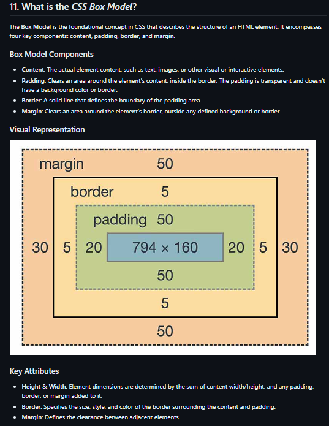

## For html 

https://www.naukri.com/code360/library/html-interview-questions 

========================================================================
========================================================================

## For Css

https://www.simplilearn.com/tutorials/css-tutorial/css-interview-questions  

## Extra : 

## Margin Collapse
- Top and bottom margins of elements are sometimes collapsed into a single margin that is equal to the largest of the two margins.
- This does not happen on left and right margins! Only top and bottom margins!

========================================================================
========================================================================
