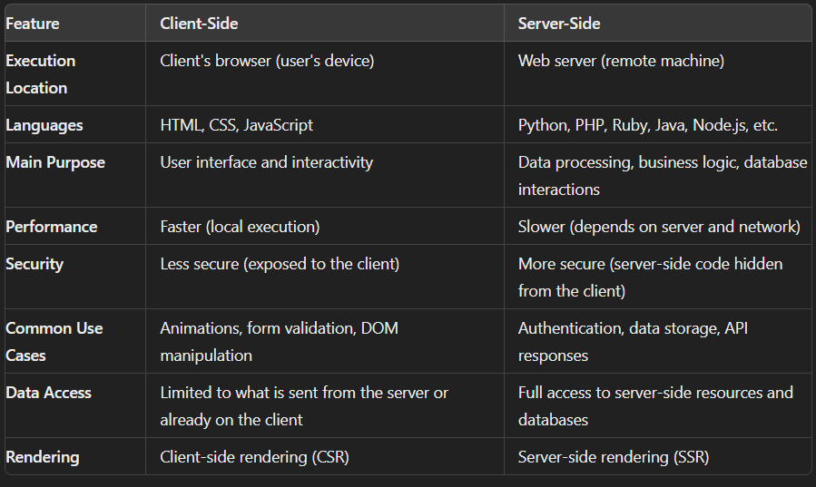

https://www.interviewbit.com/javascript-interview-questions/
https://www.simplilearn.com/tutorials/javascript-tutorial/javascript-interview-questions

### what is script in javascript

In JavaScript, the term script generally refers to a block of code written in the JavaScript language that is intended to be executed by the browser or another JavaScript runtime environment (such as Node.js). This script can include variables, functions, objects, and event handlers to create dynamic and interactive web pages or applications.

